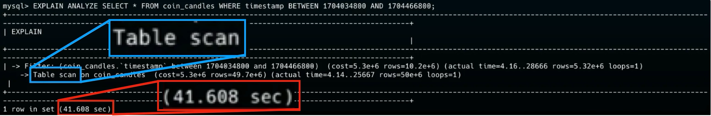
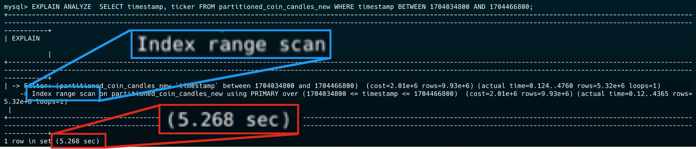
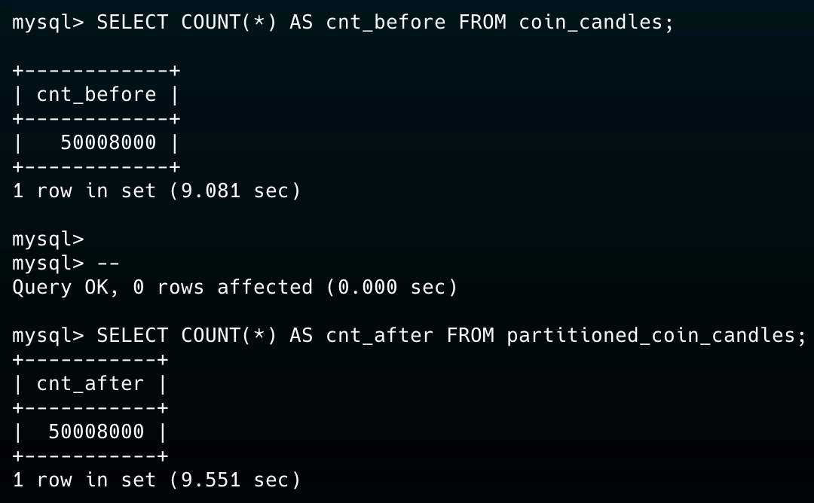
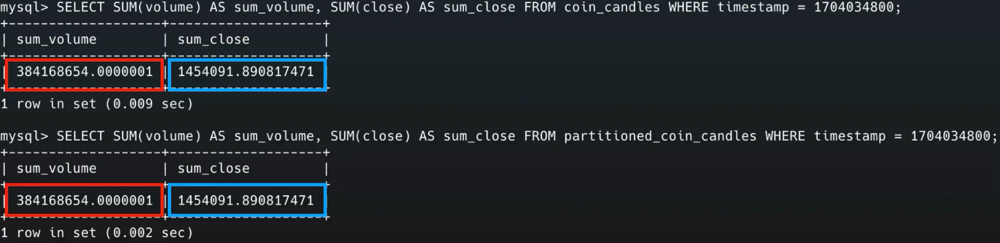
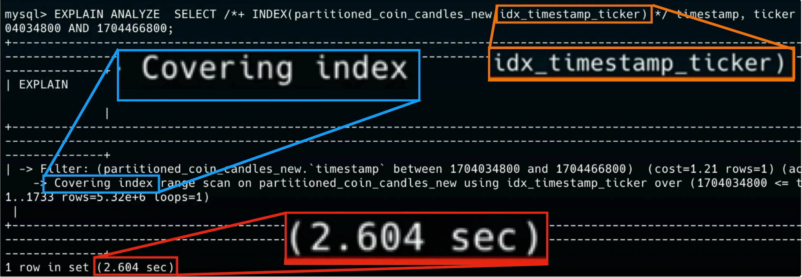

# 5,000만건 테이블에 파티셔닝 적용하기

## 문제 상황

코인 커뮤니티 서비스를 운영하던 중, 특정 시점에 DB connection이 부족해 API가 동작하지 않는 장애가 발생했다.

원인을 추적해보니 데이터 분석을 위해 주기적으로 호출되는 AWS Lambda가 문제였다. Lambda에서 실행하는 데이터 조회 쿼리의 실행 시간이 약 **2분**에 달했고, 이 쿼리가 DB connection을 오래 점유하면서 다른 API 요청들이 connection을 확보하지 못하는 상황이었다.

해당 테이블은 1시간마다 약 8,000건의 데이터가 쌓이는 구조였고, 문제를 인식했을 때는 이미 약 **5,000만 건**의 데이터가 누적되어 있었다.

## 해결 전략: 월별 테이블 파티셔닝

이 테이블은 시간 단위로 거의 동일한 양의 데이터가 쌓이는 특성을 가지고 있었다. 따라서 `timestamp` 컬럼을 기준으로 **월별 RANGE 파티셔닝**을 적용하기로 했다.

> `timestamp`는 Upbit API를 통해 가져오는 코인별 timestamp로, 코인 캔들의 시간을 나타낸다.

## 로컬 환경에서 테스트하기

운영 DB에 바로 적용하기 전에, 로컬 환경에서 충분한 테스트를 진행했다.

1. Go 언어를 활용해 운영 환경과 최대한 동일한 데이터를 CSV 파일로 생성
2. `docker cp` 명령으로 로컬의 CSV 파일을 Docker 컨테이너로 복사
3. `LOAD DATA` 명령으로 MySQL 테이블에 대량 데이터 삽입

### 기존 테이블 DDL

```sql
CREATE TABLE coin_candles (
    id bigint AUTO_INCREMENT PRIMARY KEY,
    ticker varchar(255),
    timestamp bigint,
    open double,
    high double,
    low double,
    close double,
    volume double,
    source varchar(255) NULL,
    unit varchar(255) NULL
);
```

### 파티셔닝 적용 테이블 DDL

```sql
CREATE TABLE partitioned_coin_candles (
    id BIGINT AUTO_INCREMENT,
    timestamp BIGINT NOT NULL,
    ticker VARCHAR(255),
    open DOUBLE,
    high DOUBLE,
    low DOUBLE,
    close DOUBLE,
    volume DOUBLE,
    source VARCHAR(255) NULL,
    unit VARCHAR(255) NULL,
    PRIMARY KEY (id, timestamp)
)
PARTITION BY RANGE (timestamp) (
    PARTITION p202401 VALUES LESS THAN (1706713200),
    PARTITION p202402 VALUES LESS THAN (1709218800),
    PARTITION p202403 VALUES LESS THAN (1711897200),
    PARTITION p202404 VALUES LESS THAN (1714489200),
    PARTITION p202405 VALUES LESS THAN (1717167600),
    PARTITION p202406 VALUES LESS THAN (1719759600),
    PARTITION p202407 VALUES LESS THAN (1722438000),
    PARTITION p202408 VALUES LESS THAN (1725116400),
    PARTITION p202409 VALUES LESS THAN (1727708400),
    PARTITION p202410 VALUES LESS THAN (1730386800),
    PARTITION p202411 VALUES LESS THAN (1732978800),
    PARTITION p202412 VALUES LESS THAN (1735657200),
    PARTITION pmax    VALUES LESS THAN MAXVALUE
);
```

파티셔닝 적용 시 주의할 점은, MySQL에서 파티셔닝 키(`timestamp`)가 반드시 **PRIMARY KEY에 포함**되어야 한다는 것이다. 따라서 기존의 `PRIMARY KEY (id)`를 `PRIMARY KEY (id, timestamp)`으로 변경했다.

또한 미래에 추가될 데이터를 위해 `MAXVALUE` 파티션(`pmax`)을 두어 파티션 범위를 벗어나는 데이터가 삽입되어도 오류가 발생하지 않도록 했다.

## 성능 비교

기존 쿼리와 동일한 5일치 코인 캔들 데이터 조회 쿼리를 각 테이블에 실행해 성능을 비교했다.

```sql
-- 5일치 코인 캔들 데이터 조회 쿼리
EXPLAIN ANALYZE
SELECT * FROM coin_candles WHERE timestamp BETWEEN 1704034800 AND 1704466800;
```

**파티셔닝 전**



**파티셔닝 후**



**41.608 sec -> 5.268 sec (약 690% 빨라짐)**

파티셔닝을 적용하면 MySQL이 `WHERE` 조건의 `timestamp` 범위를 보고 **해당 파티션만 스캔**(Partition Pruning)하기 때문에, 전체 5,000만 건을 풀 스캔하지 않고 필요한 월별 파티션만 탐색하게 된다.

## 파티셔닝 전후 데이터 검증

파티셔닝을 적용한 뒤 데이터의 무결성을 확인하는 것은 필수다. 아래 두 가지 방법으로 검증했다.

### 1. 전체 레코드 수 비교



### 2. 특정 컬럼의 합계 검증



> 전체 데이터에 대한 연산 시 Docker 용량 초과로 컨테이너가 다운되어, 임의의 시점(`WHERE timestamp = ?`)에 대해서 검증을 진행했다. MD5 체크섬 비교도 시도했지만 동일한 이유로 실패했다.

## Deep Dive: Covering Index로 추가 성능 개선

파티셔닝만으로도 큰 성능 향상을 얻었지만, 한 단계 더 나아가 볼 수 있었다.

실제 알고리즘이 동작하는 코드를 분석해보니, 코인 캔들 데이터에서 `timestamp`와 `ticker` 컬럼만 사용하고 있었다. 기존 쿼리는 `SELECT *`로 모든 컬럼을 조회하고 있었지만, 실제로 필요한 컬럼은 두 개뿐이었다.

따라서 쿼리를 `SELECT timestamp, ticker`로 수정하고, `(timestamp, ticker)`로 구성된 **복합 인덱스**를 생성하면 인덱스 스캔만으로 결과를 반환하는 **Covering Index**를 활용할 수 있다고 판단했다.

> **Covering Index**란 쿼리가 필요로 하는 모든 컬럼이 인덱스에 포함되어 있어, 실제 테이블 데이터(클러스터드 인덱스)에 접근하지 않고 인덱스만으로 쿼리를 처리할 수 있는 인덱스를 말한다.

```sql
CREATE TABLE `partitioned_coin_candles_covered` (
  `id` bigint NOT NULL AUTO_INCREMENT,
  `timestamp` bigint NOT NULL,
  `ticker` varchar(255) DEFAULT NULL,
  `open` double DEFAULT NULL,
  `high` double DEFAULT NULL,
  `low` double DEFAULT NULL,
  `close` double DEFAULT NULL,
  `volume` double DEFAULT NULL,
  `source` varchar(255) DEFAULT NULL,
  `unit` varchar(255) DEFAULT NULL,
  PRIMARY KEY (`timestamp`,`id`),
  KEY `idx_id` (`id`),
  KEY `idx_timestamp_ticker` (`timestamp`,`ticker`)
)
PARTITION BY RANGE (`timestamp`)
(PARTITION p202401 VALUES LESS THAN (1706713200) ENGINE = InnoDB,
 PARTITION p202402 VALUES LESS THAN (1709218800) ENGINE = InnoDB,
 PARTITION p202403 VALUES LESS THAN (1711897200) ENGINE = InnoDB,
 PARTITION p202404 VALUES LESS THAN (1714489200) ENGINE = InnoDB,
 PARTITION p202405 VALUES LESS THAN (1717167600) ENGINE = InnoDB,
 PARTITION p202406 VALUES LESS THAN (1719759600) ENGINE = InnoDB,
 PARTITION p202407 VALUES LESS THAN (1722438000) ENGINE = InnoDB,
 PARTITION p202408 VALUES LESS THAN (1725116400) ENGINE = InnoDB,
 PARTITION p202409 VALUES LESS THAN (1727708400) ENGINE = InnoDB,
 PARTITION p202410 VALUES LESS THAN (1730386800) ENGINE = InnoDB,
 PARTITION p202411 VALUES LESS THAN (1732978800) ENGINE = InnoDB,
 PARTITION p202412 VALUES LESS THAN (1735657200) ENGINE = InnoDB,
 PARTITION pmax VALUES LESS THAN MAXVALUE ENGINE = InnoDB);
```

여기서 주목할 변경점은 두 가지다:

1. **PRIMARY KEY를 `(timestamp, id)`로 변경** - `timestamp`를 PK의 선두 컬럼으로 두어 파티션 내에서 timestamp 기준 정렬이 유지되도록 했다.
2. **`idx_timestamp_ticker` 복합 인덱스 추가** - 실제 쿼리에서 사용하는 `timestamp`와 `ticker`만으로 구성된 Covering Index다.

### 최종 성능 비교



| 단계 | 실행 시간 | 개선율 |
|------|-----------|--------|
| 파티셔닝 전 (원본) | 41.608 sec | - |
| 파티셔닝 적용 | 5.268 sec | 약 690% 빨라짐 ((41.608 / 5.268 - 1) * 100) |
| 파티셔닝 + Covering Index | 2.604 sec | 약 1,498% 빨라짐 ((41.608 / 2.604 - 1) * 100) |

파티셔닝과 Covering Index를 함께 적용한 결과, 원본 대비 **약 1,498% 빠른 성능**을 달성했다. 단순히 쿼리 실행 시간만 줄어든 것이 아니라, DB connection 점유 시간이 대폭 감소하면서 운영 환경의 안정성도 크게 개선되었다.
